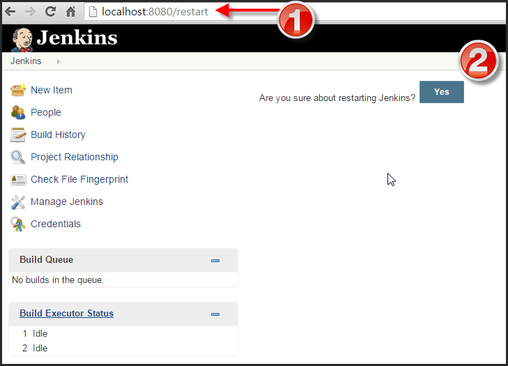

# spoke-hub-integration
A Hub-and-Spoke integration model of Software Engineering Tools

This plugin integrates Jenkins with [Slack] (https://slack.com/).
It allows to receive [Slash Commands] (https://api.slack.com/slash-commands) from Slack via
HTTP POST requests and trigger the corresponding actions.

The plugin currently supports the following commands:

	1. /jenkins build JOB [-p]
	
	   Starts a build for any type of job.
	   
	   JOB : Name of the job to build
	   -p  : Specifies the build parameters in the key=value format
	   
	   Examples:
	   
	   - /jenkins build MyJob
	   - /jenkins build MyJob -p key1=value1 ... -p keyN=valueN
	   
	2. /jenkins test JOB SCOPE [CLASS]
	
	   Performs tests for a maven job.
	   
	   JOB   : Name of the maven job to test
	   SCOPE : Specifies the scope of the test. You can choose between:
	           all : tests all classes
	           class : tests specific classes
	   CLASS : List of classes separated by a comma. (E.g. Test1,Test2,...)
	   
	   Examples:
	   
	   - /jenkins test MyJob all
	   - /jenkins test MyJob class Test1,Test2,...
	   
	3. /jenkins list-jobs
	
	   Lists all jobs.
	   
	4. /jenkins help [COMMAND]
	
	   Lists all the available commands or a detailed description of single command.
	   
	   COMMAND : Name of the command
	   
	   Examples:
	   
	   - /jenkins help
	   - /jenkins help build
	   
	NOTE: project names and parameters must comply with the following restrictions:
	      - they must not contain spaces
	      - they can start with a lowercase letter, capital letter, underscore or $
	
	NOTE: if you make a class test and there are classes with the same name but are in different packages, 
	      the test command will test all these classes
	   
## Installation

### Slack Configuration

	1. Create your Slack team
	
	2. Sign in to your Slack team
	
	3. Go to "App & Custom Integrations"
	

	
	4. Create a new Slash Command paying attention to the following points:
	   
	   - In the "URL" field type your Jenkins URL follow by "webhook/" (E.g. http://YOUR_JENKINS_URL/webhook/)
	   
	   - Leave the "Method" field set to POST
	   
	   - Copy the "Token" value
	   

	   
### Jenkins Configuration

	1. Download spoke-hub-integration.hpi from the spoke-hub-integration folder

	2. In your Jenkins dashboard click on "Manage Jenkins" -> "Manage Plugins" -> "Advanced"
	
	3. Go to "Upload Plugin", choose the hpi file and click "Upload"
	

	

	
	4. After it's installed, restart Jenkins by adding "/restart" to your Jenkins URL. Then click "Yes"
	

	
	5. In your Jenkins dashboard click on "Manage Jenkins" -> "Configure System"
	

	
	6. Find the "Slack Slash Command Settings" section, paste the Token value previously copied in the 
	   "Slash Command Token" field and select the checkbox if you would like the response to be visible 
	   to all members of the channel in which the user typed the command
	   

	
	7. Finally, click "Save" button
